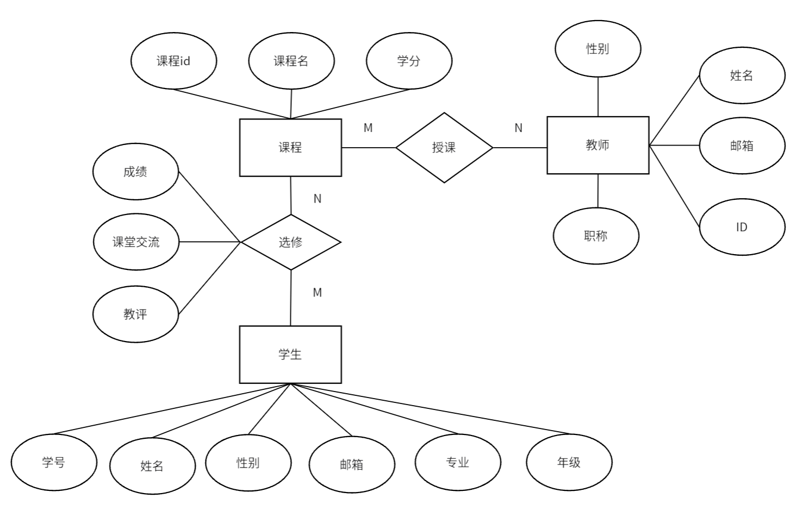

# 学生信息管理系统设计文档

## 1. 需求分析

### 1.1 项目背景与目标

随着信息化时代的到来，教育行业逐渐向数字化、智能化方向发展。传统的学生信息管理方式存在许多问题，如数据分散、信息更新滞后、权限管理混乱等。因此，本系统的设计目标是通过构建一个集学生信息、选课信息、成绩信息管理为一体的综合性系统，提升学校教学管理效率，确保数据安全性和实时性，方便学生、教师及管理员管理相关信息。

### 1.2 功能需求

- **学生功能：**
  - 查询个人信息（姓名、学号、邮箱等）
  - 修改个人信息
  - 查看自己的课程成绩
  - 选课与退课功能
  - 查看教务通知
  - 参与课程交流区

- **教师功能：**
  - 查看自己授课的课程列表及选课情况
  - 修改个人信息
  - 查看学生名单
  - 上传与修改学生成绩
  - 查看教务通知
  - 参与课程交流区

- **管理员功能：**
  - 管理学生信息、教师信息及课程信息
  - 发布教务通知
  - 监管课程交流区

### 1.3 系统约束

- 使用 SQL Server 作为数据库管理系统。
- 前端使用 Streamlit 进行开发和展示。
- 系统应支持多个角色（学生、教师、管理员）并根据角色控制访问权限。

---

## 2. 概念结构设计

### 2.1 实体关系模型（ER图）

以下是系统中各实体及其关系的概念结构设计：

#### 实体：
##### 学生（Student）
- 学号：学生的唯一标识
- 姓名：学生的名字
- 性别：学生的性别
- 邮箱：学生的联系方式
- 专业：学生所学的专业
- 年级：学生所在的年级 
##### 课程（Course）
- 课程id：课程的唯一标识
- 课程名：课程的名称
- 学分：课程的学分

##### 教师（Teacher）
- ID：教师的唯一标识
- 姓名：教师的名字
- 性别：教师的性别
- 邮箱：教师的联系方式
- 职称：教师的职位或称号

#### 关系：
##### 授课（Teaches）
连接 **教师** 和 **课程** 两个实体,表示教师授课的关系,关系类型为 多对多（M:N），即一个教师可以教授多门课程，而一门课程也可以由多位教师授课。

##### 选修（Enrollment）
连接 **学生** 和 **课程** 两个实体,表示学生选修课程的关系,关系类型为 多对多（M:N），即一个学生可以选修多门课程，而一门课程可以被多个学生选修,该关系附带的属性：
- 成绩：选修课程的成绩
- 课堂交流区：学生和老师在课堂交流区的发言
- 教评：对课程或教师的评价
## 3. 逻辑结构设计

### 3.1 数据库表设计

以下是系统中各数据表的结构设计：

#### 数据表设计

##### 教师表（teachers）

| 字段名         | 数据类型         | 约束             | 描述           |
|----------------|----------------|-----------------|---------------|
| `TeacherID`    | INT            | PRIMARY KEY     | 教师唯一标识   |
| `TeacherName`  | NVARCHAR(100)  | NOT NULL        | 教师姓名       |
| `Email`        | NVARCHAR(100)  |                 | 教师邮箱       |
| `Position`     | NVARCHAR(50)   |                 | 教师职位       |

---

##### 学生表（students）

| 字段名         | 数据类型         | 约束             | 描述           |
|----------------|----------------|-----------------|---------------|
| `StudentID`    | INT            | PRIMARY KEY     | 学生唯一标识   |
| `StudentName`  | NVARCHAR(100)  | NOT NULL        | 学生姓名       |
| `Email`        | NVARCHAR(100)  |                 | 学生邮箱       |
| `Major`        | NVARCHAR(50)   |                 | 学生专业       |
| `Grade`        | NVARCHAR(20)   |                 | 学生年级       |

---

##### 课程表（courses）

| 字段名         | 数据类型         | 约束                  | 描述           |
|----------------|----------------|----------------------|---------------|
| `CourseID`     | INT            | PRIMARY KEY          | 课程唯一标识   |
| `CourseName`   | NVARCHAR(100)  | NOT NULL             | 课程名称       |
| `Credits`      | INT            |                      | 课程学分       |
| `TeacherID`    | INT            | FOREIGN KEY          | 授课教师ID     |

---

##### 选课表（course_enrollments）

| 字段名         | 数据类型         | 约束                          | 描述               |
|----------------|----------------|------------------------------|-------------------|
| `EnrollmentID` | INT            | PRIMARY KEY, IDENTITY(1,1)   | 选课记录唯一标识   |
| `StudentID`    | INT            | FOREIGN KEY                  | 学生ID             |
| `CourseID`     | INT            | FOREIGN KEY                  | 课程ID             |
| `Grade`        | INT            | CHECK(Grade >= 0 AND Grade <= 100) | 成绩（0-100）     |

---

##### 课堂交流表（class_interaction）

| 字段名           | 数据类型         | 约束                        | 描述                 |
|------------------|-----------------|----------------------------|---------------------|
| `InteractionID`  | INT             | PRIMARY KEY, IDENTITY(1,1) | 自动生成的记录ID      |
| `CourseID`       | INT             | NOT NULL                   | 班级号               |
| `SpeakerType`    | VARCHAR(50)     | NOT NULL                   | 发言人身份           |
| `SpeakerName`    | VARCHAR(100)    | NOT NULL                   | 发言人姓名           |
| `Content`        | TEXT            | NOT NULL                   | 发言内容             |
| `Timestamp`      | DATETIME        | DEFAULT GETDATE()          | 发言时间，默认当前时间|

---

##### 教务通知表（academic_notices）

| 字段名            | 数据类型         | 约束                        | 描述                  |
|-------------------|-----------------|----------------------------|----------------------|
| `NotificationID`  | INT             | PRIMARY KEY, IDENTITY(1,1) | 自动生成的通知ID       |
| `Title`           | VARCHAR(255)    | NOT NULL                   | 通知标题              |
| `Content`         | TEXT            | NOT NULL                   | 通知内容              |
| `Publisher`       | VARCHAR(100)    | NOT NULL                   | 发布人（如教务处）      |
| `PublishDate`     | DATETIME        | DEFAULT GETDATE()          | 发布日期，默认当前时间  |
| `EffectiveDate`   | DATETIME        |                            | 生效日期              |
| `ExpirationDate`  | DATETIME        |                            | 到期日期              |
| `Status`          | VARCHAR(50)     | DEFAULT 'Active'           | 通知状态（Active/Expired）|

##### 关系说明
1. **教师表** 和 **课程表** 通过 `TeacherID` 建立外键关联。
2. **学生表** 和 **选课表** 通过 `StudentID` 建立外键关联。
3. **课程表** 和 **选课表** 通过 `CourseID` 建立外键关联。

---

## 4. 物理结构设计

### 4.1 存储设计

- 数据库使用 SQL Server 存储，所有表格的字段类型及长度已在逻辑结构设计中进行定义。
- 对于每个表格，索引和外键约束根据需要进行优化，确保数据一致性和查询效率。

### 4.2 数据库优化

- **索引优化：** 为常用查询字段（如学号、课程号）添加索引，提高查询速度。
- **分区优化：** 对于成绩表和选课表，考虑按学期、课程等进行分区，以提高查询性能。
  
### 4.3 数据备份与恢复

- 定期进行数据库备份，确保数据的安全性。
- 配置数据库的灾难恢复方案，确保在系统故障时可以恢复数据。

---

## 5. 数据库实施

### 5.1 数据库创建

- 创建数据库并定义表格结构（如前文所述）。

### 5.2 数据操作

- **增**：使用 `INSERT INTO` 语句向各表插入数据。
- **删**：使用 `DELETE` 语句删除不需要的数据。
- **改**：使用 `UPDATE` 语句修改数据。
- **查**：使用 `SELECT` 语句查询数据。

---

## 6. 应用系统开发与试运行

### 6.1 前端开发

- 使用 Streamlit 构建用户界面，确保用户体验流畅，适配不同设备（PC、手机等）。
- 完成登录页面、学生信息管理、选课、成绩查询等模块的开发。

### 6.2 后端开发

- 使用 Python 与 SQL Server 进行连接，处理前端请求，执行数据库操作。
- 实现基于角色的权限控制，确保不同角色访问不同功能。

### 6.3 试运行

- 在小范围内进行系统测试，确保功能正常运行。
- 进行性能优化，确保系统可以处理大规模用户访问。

---

## 7. 实验总结

在本次项目开发过程中，我们通过合理的需求分析、精确的数据库设计及高效的系统开发，成功构建了一个学生信息管理系统。该系统实现了学生、教师、管理员等不同角色的功能需求，并采用了角色权限管理、数据加密等技术确保系统的安全性和稳定性。

通过系统测试，我们发现一些性能瓶颈，如查询大型数据时可能存在延迟，已采取索引优化等手段进行改进。未来，系统可以扩展更多功能，如教学质量反馈、课程评价等，以进一步提升系统的服务能力。

---
